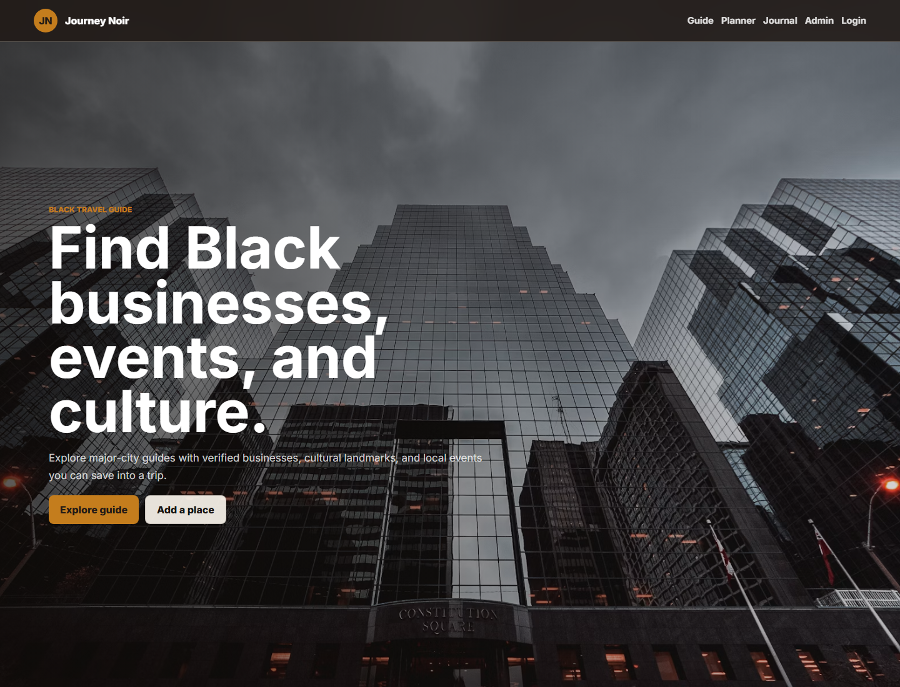
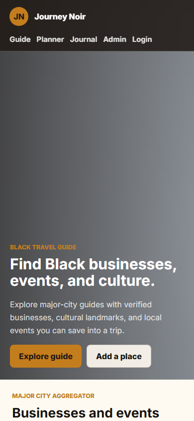

# Journey Noir

A Firebase-powered Black travel guide, major-city business/event aggregator, and
trip planner.

## Screenshots





## MVP Features

- Email/password, Google, and Apple login with Firebase Authentication.
- Saved traveler profiles and preferences.
- Major-city guide with businesses, events, museums, cultural attractions, and city filters.
- Business listing cards with category, city/state, verification state, tags, source links, ratings, and map coordinates.
- Interactive OpenStreetMap panel for listings with latitude/longitude.
- Favorite places, trip wishlists, bookmarked city-style filtering, and saved itineraries.
- User-submitted business/event form with proof field and pending approval status.
- Reviews with star ratings, comments, travel tips, and optional photo upload.
- Travel journal with notes, favorite places visited, and Firebase Storage photo uploads.
- AI itinerary planner form that stores generated itinerary drafts per user.
- Admin dashboard for approving submissions, rejecting spam, and publishing listings.
- Firebase Cloud Messaging token capture for push notification campaigns.
- Vercel API aggregation route for Foursquare, Eventbrite, and Geoapify.

## Firebase Collections

The app is structured around this MVP Firestore model:

- `users`
- `businesses`
- `cities`
- `favorites` under each user
- `reviews`
- `submissions`
- `itineraries` under each user
- `events`
- `journal` under each user

## Example Business Document

```json
{
  "name": "Example Restaurant",
  "category": "restaurant",
  "city": "Chicago",
  "state": "IL",
  "blackOwned": true,
  "verified": true,
  "address": "123 Main St",
  "website": "https://example.com",
  "tags": ["brunch", "soul food", "Black-owned"],
  "rating": 4.8,
  "lat": 41.8781,
  "lng": -87.6298,
  "createdAt": 1792368000000
}
```

## Firebase Setup

1. Create a Firebase project at <https://console.firebase.google.com/>.
2. Add a web app in Project settings.
3. Copy the web app config into `app.js`.
4. Enable Authentication providers:
   - Email/Password
   - Google
   - Apple
5. Create a Cloud Firestore database and publish `firestore.rules`.
6. Enable Firebase Storage and publish `storage.rules`.
7. For push notifications, create a Web Push certificate and place the public VAPID key in `app.js`.
8. Add a custom auth claim of `admin: true` for admin users so the dashboard can approve submissions.

The app disables account-dependent actions until the Firebase placeholders in
`app.js` are replaced.

## Vercel Environment Variables

Add these in Vercel Project Settings > Environment Variables:

```bash
FOURSQUARE_API_KEY=
EVENTBRITE_PRIVATE_TOKEN=
GEOAPIFY_API_KEY=
```

The aggregation route is `api/aggregate.js`, so these provider keys are never
placed in frontend code.

## AI Itinerary Planner

The static MVP stores itinerary prompts and placeholder generated drafts in each
user's `itineraries` collection. Connect the `#ai-form` submit handler in
`app.js` to a secure server endpoint or Firebase Cloud Function before using a
paid AI model in production.

## Run Locally

Serve the folder with any static server.

```bash
python -m http.server 3005 --bind 127.0.0.1
```

Then open <http://127.0.0.1:3005/>.
